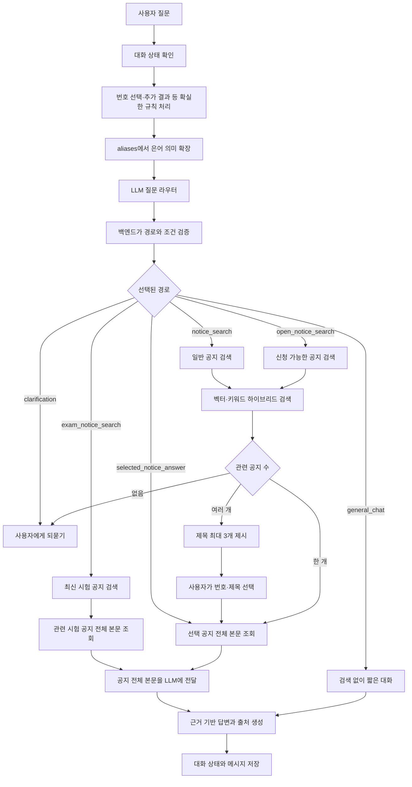

# 6th-NotiCE-ai

홍익대학교 컴퓨터공학과 공지를 검색하고, 검색된 공지만 근거로 답변하는 한국어
RAG 챗봇입니다.

## 최종 목표 워크플로우



LLM 라우터는 다음 경로만 구조화된 JSON으로 반환합니다.

| 경로 | 역할 |
| --- | --- |
| `notice_search` | 장학금, 인턴, 졸업, 행사 등 일반 공지 검색 |
| `open_notice_search` | 현재 신청 가능하거나 마감이 임박한 공지 검색 |
| `exam_notice_search` | 중간·기말 시험 날짜, 시간, 장소 공지 검색 |
| `selected_notice_answer` | 사용자가 선택한 공지의 후속 질문 처리 |
| `general_chat` | 인사와 감사처럼 검색이 필요 없는 짧은 대화 |
| `clarification` | 검색 대상이 불명확할 때 되묻기 |

번호 선택, `다른 건 없어?`, 명확한 후속 질문은 코드 규칙으로 먼저 처리합니다.
LLM 응답이 잘못되거나 API 호출이 실패하면 기존 규칙 분류로 자동 복귀합니다.

## 현재 구현

- Supabase `notices` 220건 조회
- 공지 220건을 나눈 `notice_chunks` 520건과 E5 임베딩 저장
- 의미 점수 0.75와 키워드 점수 0.25를 결합한 하이브리드 검색
- Supabase 벡터·키워드 검색 RPC와 결과 병합
- 구조화된 LLM 질문 라우터와 규칙 기반 실패 복귀
- `aliases(id, alias, meaning)` 조회 코드와 질문 은어 확장
- 붙여쓰기 보정과 `kiwipiepy` 기반 검색 키워드 추출
- 제목 최대 3개 제시 후 번호·서수·제목 선택
- `다른 건 없어?`에서 이미 보여준 공지 제외
- 선택 공지의 `notices.content` 전체 재조회
- 시험 질문은 공지 선택 없이 관련 공지 전체를 읽고 바로 답변
- 공지를 선택한 뒤에도 원래 질문을 유지해 해당 내용으로 답변
- 검색된 공지만 사용하는 LLM 답변과 출처 강제 첨부
- 실행 중인 프로세스 안에서 이전 검색과 선택 공지 기억
- 신규·변경·손상 공지만 다시 임베딩하는 청크 적재 작업

전체 단위 테스트는 현재 48개입니다.

## 현재 제한

- Supabase `aliases` 테이블과 초기 데이터가 배포되기 전에는 은어 없이 검색합니다.
- `open_notice_search` 경로 분류는 구현됐지만 신청 기간 데이터와 DB 필터는 아직 없습니다.
- 시험 일정은 별도 테이블 없이 공지 전체 본문의 표를 LLM이 읽습니다. 크롤링 결과에서
  표의 행과 열이 보존돼야 합니다.
- 대화 상태는 프로세스 메모리에만 있어 재실행하거나 재접속하면 사라집니다.

## 구현할 작업

### 중간 데모 전

- [ ] 실제 Supabase 은어 데이터로 전체 검색 흐름 검증
- [ ] `open_notice_search`와 신청 가능 필터 통합
- [ ] 시험 질문에서 최신 시험 공지와 전체 표 조회 검증
- [ ] 라우터 대표 질문과 실패 시나리오 평가 세트 작성
- [ ] 중간 데모 질문과 답변 흐름 고정

### 중간 데모 이후

- [ ] `chat_sessions`, `chat_messages`를 통한 대화 상태 영속화
- [ ] 최근 대화와 선택 공지를 사용한 자연스러운 후속 답변 개선
- [ ] 답변 피드백 저장과 검색 기준값 평가

현재 범위에서는 `notice_deadlines`, `courses`, `exam_schedules` 테이블을 만들지
않습니다. 신청 시작·마감만 `notices`에 구조화하고, 대회 일정과 시험 정보는 선택된
공지 전체 본문을 LLM이 읽어 답합니다.

## 데이터 구조

현재 및 확정된 핵심 테이블만 사용합니다.

```text
notices 1 ── N notice_chunks

aliases

chat_sessions 1 ── N chat_messages  (중간 데모 이후)
```

`aliases` 계약:

```text
id       bigint identity primary key
alias    text not null unique
meaning  text not null
```

신청 가능 상태는 고정 문자열로 저장하지 않고 `Asia/Seoul` 기준 현재 시각과
`application_start_at`, `application_end_at`을 비교해 조회 시점에 계산합니다.

## 주요 코드

| 파일 | 역할 |
| --- | --- |
| `rag/src/router.py` | LLM 질문 경로와 검색 문장 생성 |
| `rag/src/preprocess.py` | 은어 확장, 붙여쓰기 보정, 키워드 추출 |
| `rag/src/conversation.py` | 현재 프로세스의 검색·선택 상태 관리 |
| `rag/src/retriever.py` | Supabase 청크 검색 결과 병합 |
| `rag/src/search.py` | 전체 챗봇 실행 흐름 |
| `rag/src/llm.py` | 근거 기반 답변과 일반 대화 생성 |
| `rag/src/db.py` | Supabase 및 JSON 저장소 연결 |
| `supabase/notice_chunks.sql` | 청크 인덱스, RLS, 검색 RPC |

## 실행

레포 최상위 `.env`를 설정합니다.

```env
GEMINI_API_KEY=your_api_key
SUPABASE_URL=https://your-project.supabase.co
SUPABASE_KEY=sb_publishable_your_key
NOTICE_SOURCE=auto
RAG_SEARCH_SOURCE=chunks
```

의존성 설치와 챗봇 실행:

```bash
rag/.venv/bin/pip install -r rag/requirements.txt
rag/.venv/bin/python -m rag.src.search
```

Supabase 설정이 없거나 `NOTICE_SOURCE=json`이면
`rag/data/sample_notices.json`을 사용합니다. 첫 실행에는
`intfloat/multilingual-e5-small` 모델 다운로드가 필요합니다.

## 청크 갱신

생성 결과를 SQL로 검토:

```bash
rag/.venv/bin/python -m rag.src.chunk_notices
```

변경된 공지만 Supabase에 반영:

```bash
rag/.venv/bin/python -m rag.src.chunk_notices --apply
```

전체 공지를 강제로 다시 생성:

```bash
rag/.venv/bin/python -m rag.src.chunk_notices --apply --force
```

`--apply`에는 크롤러 또는 관리 백엔드에서만 사용하는 `SUPABASE_SECRET_KEY`가
필요합니다.

## 테스트

```bash
rag/.venv/bin/python -m unittest discover -s rag/tests -v
```
